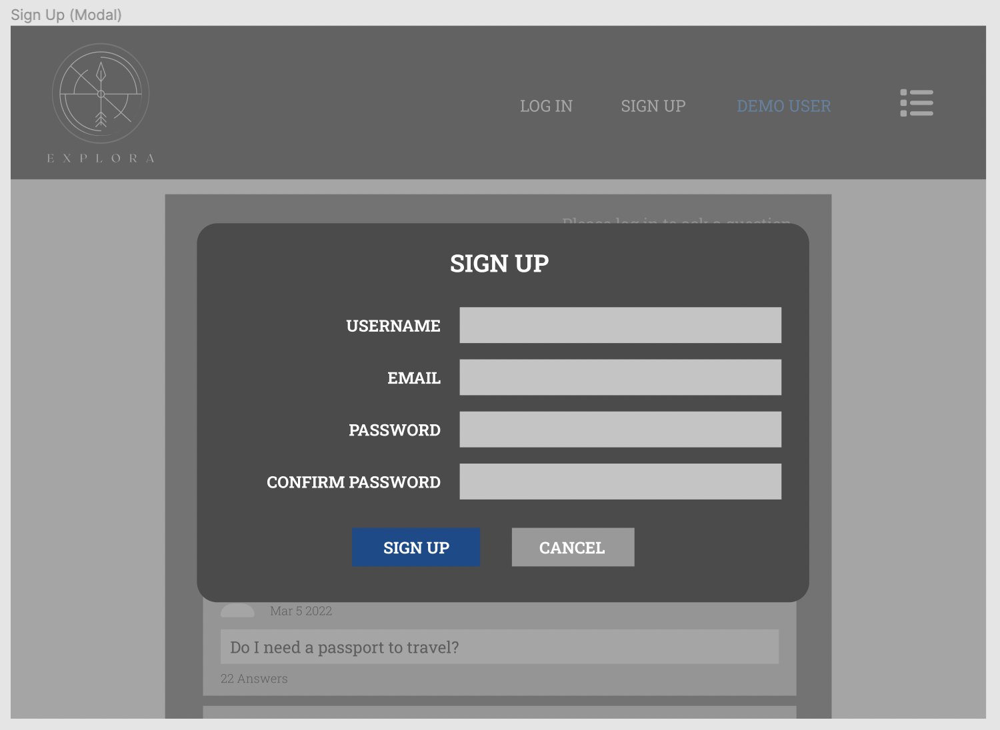

 

---

 

## Explora: Table of Contents

-   [Link to Live Site](https://github.com/willkee/explora/edit/main/README.md#link-to-live-site)
-   [Description](https://github.com/willkee/explora/edit/main/README.md#description)
-   [Technologies](https://github.com/willkee/explora/edit/main/README.md#technologies)
-   [Features](https://github.com/willkee/explora/edit/main/README.md#features)
-   [Wireframes](https://github.com/willkee/explora/edit/main/README.md#wireframes)
     

 

---

 

## Link to Live Site

-   [Explora Live Site](https://explora-quora-clone.herokuapp.com/)

 

---

 

## Description

Explora is a Quora clone where users can ask the community questions related to travel to various destinations.

 

---

 

## Technologies

 

  
  &nbsp;
  
  &nbsp;
  
  &nbsp;
  
  &nbsp;
  
  &nbsp;
  
  &nbsp;
  
  &nbsp;
  
  &nbsp;
  
  &nbsp;
  
  &nbsp;
  

 

---

 

## Getting Started

 

1.  Clone this repository:

            git clone git@github.com:willkee/explora.git

     

2.  Install dependencies from the root directory.

            npm install

     

3.  Create a user on PostgreSQL (psql) with a `PASSWORD` and `CREATEDB` privileges. Remember to include the semicolon `;` at the end of the line.

        CREATE USER <username> WITH PASSWORD <password> CREATEDB;

     

4.  In the backend directory, create a `.env` file based on the `.env.example` file also found in the backend directory.
     

5.  Enter your chosen username and password into the respective fields in the `.env` file you just created. Enter your chosen database **name** and `PORT`. You may enter a secure combination of characters into `JWT_SECRET` or use the following in `node` in your terminal to generate a secure string.

        require("crypto").randomBytes(32).toString("hex")

     

6.  Add a numeric value to `JWT_EXPIRES_IN`. By default, you may use `604800` which is the number of seconds in a week.

 

7.  Add the following proxy code to your package.json file in the `frontend` directory. If you chose any port other than `5000`, replace the port number there now.

        "proxy": "http://localhost:5000"

     

8.  Run the following code in your backend directory to run the creation of the database and migrations as well as to seed the database.

        npx dotenv sequelize db:create
        npx dotenv sequelize db:migrate
        npx dotenv sequelize db:seed:all

     

9.  Start the backend and frontend servers in the backend and frontend directories, respectively. After starting the frontend server, your browser should open the application automatically. If not, navigate to `http://localhost:3000`

        npm start

     

10. You may use the demo user or sign up as a new user to take advantage of the features of the application.

 

---

 

## Features

-   The home page displays the most recent questions on the site
-   Users can post questions
-   Users can post answers to existing questions (but not to their own questions)
-   Users can upvote answers to questions (but not to their own answers)
-   Unauthenticated users can view all questions and answers

 

---

 

## Error Handling

 

---

 

## Wireframes

 

---

 
